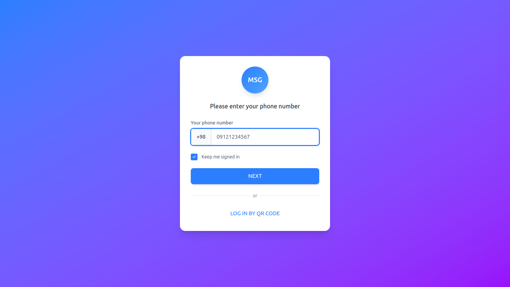
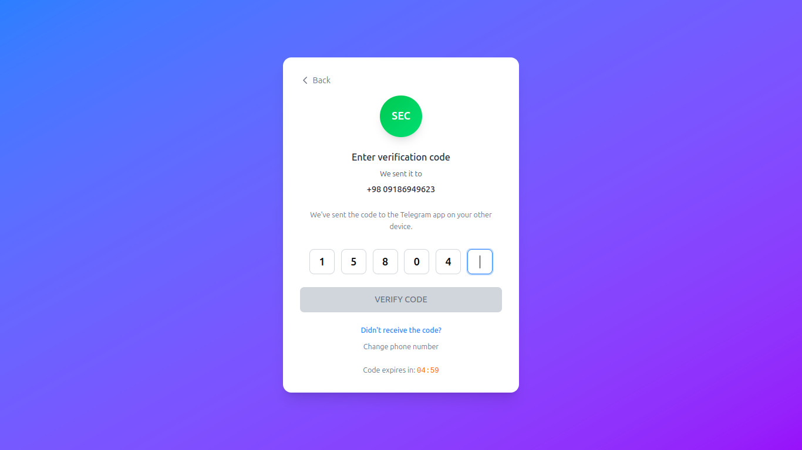
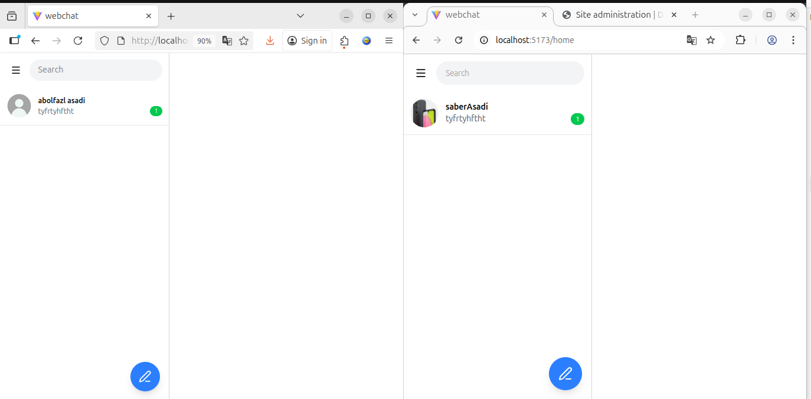
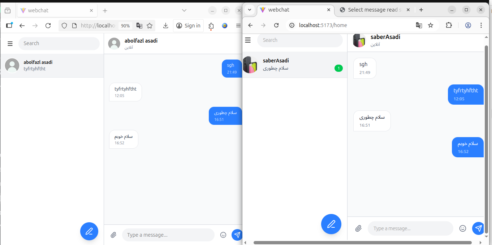
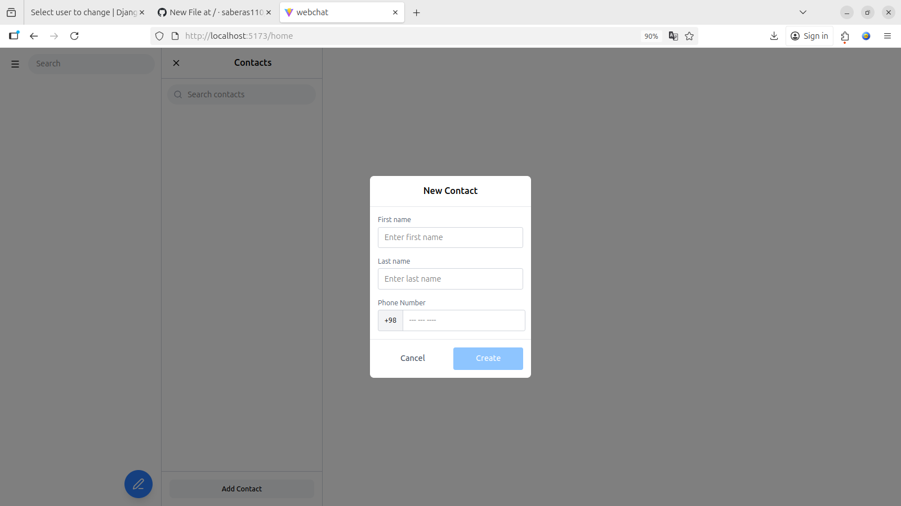
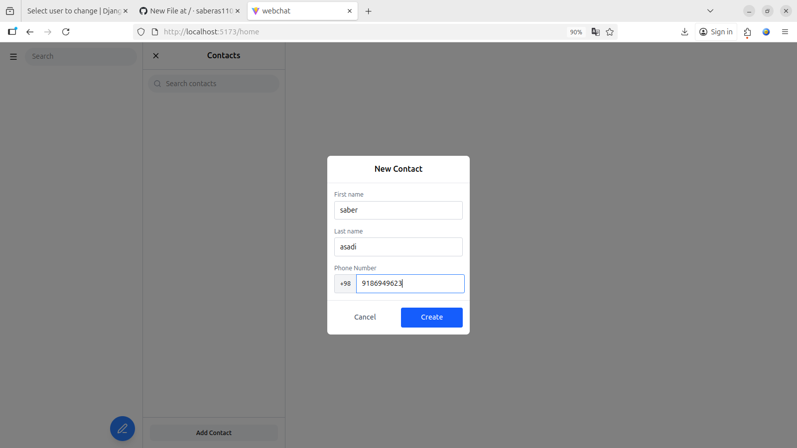
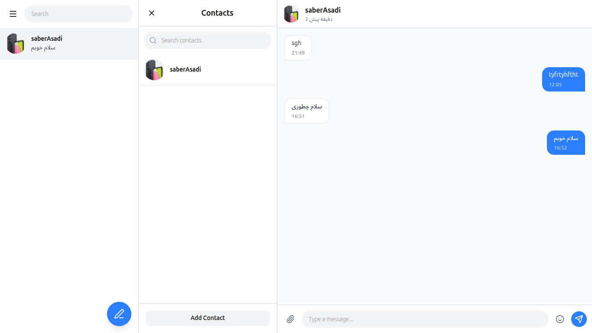

# WebChat

[]()
[]()
[]()
[]()
[]()
[]()
[]()

**WebChat** یک وب اپلیکیشن چت ریل‌تایم است که فرانت‌اند و بک‌اند آن توسط خودم توسعه داده شده است. این پروژه هنوز در حال توسعه است و هدف آن نمایش توانایی من در توسعه وب اپلیکیشن‌های پیچیده، امن و مقیاس‌پذیر برای رزومه کاری است.

---

## 🚀 ویژگی‌ها (Features)

- ثبت‌نام و ورود کاربران با شماره تلفن و **احراز هویت JWT**  
- ارسال کد ۶ رقمی با تاریخ انقضای ۲ دقیقه برای تأیید شماره تلفن  
- ذخیره امن توکن‌های **Access و Refresh** در کوکی‌های مرورگر  
- چت ریل‌تایم شبیه به Telegram Web  
- وضعیت آنلاین و آخرین بازدید کاربران با **WebSocket**  
- مدیریت مخاطبین و ایجاد کانورسیشن جدید خودکار  
- **Axios Interceptors** برای مدیریت CSRF Token و Refresh Token  
- Middleware در بک‌اند برای مدیریت احراز هویت و رفرش توکن  
- **Redis** برای لایه Channels و مدیریت WebSocket  
- **PostgreSQL** به عنوان دیتابیس اصلی  

---

## 🛠️ تکنولوژی‌ها (Tech Stack)

- **Backend:** Python, Django, Django REST Framework, Django Channels  
- **Frontend:** React, Axios, CSS Modules  
- **Realtime & WebSocket:** Django Channels  
- **Authentication:** JWT, CSRF Token, HttpOnly Cookies  
- **Database:** PostgreSQL  
- **Caching / Channels Layer:** Redis  

---

## 📦 Dependencies / Key Libraries

- Django==5.2.7  
- djangorestframework==3.16.1  
- djangorestframework_simplejwt==5.5.1  
- Django Channels==4.3.1  
- channels_redis==4.3.0  
- Daphne==4.2.1  
- psycopg2-binary==2.9.10  
- Redis==6.4.0  
- Pillow==11.3.0  

---

## ⚙️ نصب و راه‌اندازی لوکال (Installation)

```bash
# راه‌اندازی بک‌اند
cd backend
pip install -r requirements.txt
python manage.py migrate
python manage.py runserver

# راه‌اندازی فرانت‌اند
cd frontend
npm install
npm start
```

> مطمئن شوید PostgreSQL و Redis در سیستم شما نصب و در حال اجرا هستند.

---

## 💻 استفاده (Usage)

1. کاربر شماره تلفن خود را وارد می‌کند و کد تأیید دریافت می‌کند.  
2. با ورود موفق، به صفحه اصلی چت هدایت می‌شود.  
3. پیام‌ها به صورت ریل‌تایم ارسال و دریافت می‌شوند.  
4. وضعیت آنلاین و آخرین بازدید کاربران با WebSocket مدیریت می‌شود.  
5. امکان مشاهده، افزودن مخاطبین و ایجاد کانورسیشن جدید وجود دارد.  

---

## 📷 Screenshots

### شماره


### کد OTP


### صفحه اصلی


### چت با کاربر دیگر


### مخاطبین و اخرین بازدید




---

## 🎯 اهداف آینده (Future Work)

- اضافه کردن پیام صوتی و تصویری  
- نوتیفیکیشن‌های دسکتاپ و موبایل  
- طراحی واکنش‌گرا و بهبود رابط کاربری  
- سیستم جستجو و فیلتر چت‌ها  
- افزایش پوشش تست و CI/CD  

---

## 📂 Contribution

این پروژه توسط من توسعه داده شده و فعلاً Contribution عمومی ندارد، ولی بازخورد و پیشنهادات شما همیشه خوش‌آمد است.  

---

## ⚡ License

این پروژه تحت [MIT License](LICENSE) ارائه شده است.
